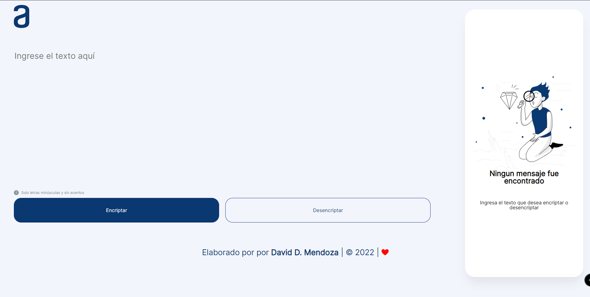
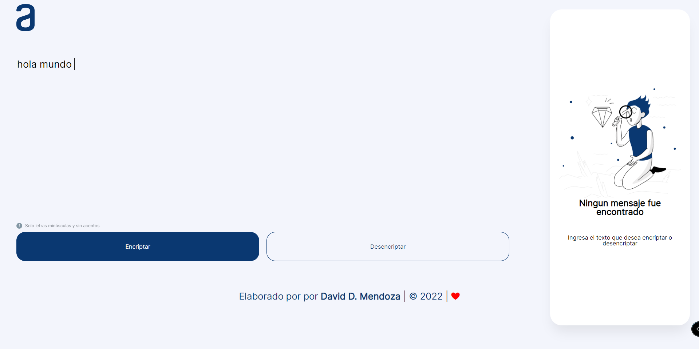
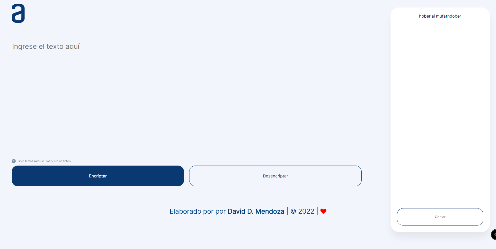

<h1 align="center"> CHALLENGE-1 
ENCRIPTADOR</h1> 

------------

------------

## Descripcion del Proyecto:

Proyecto dado por Alura para el programa ONE  
Este es el primer proyecto, en el cual le daremos vida a un **Encriptador de Texto**, así podrás intercambiar mensajes secretos con otras personas que sepan el secreto de la encriptación utilizada.

## :hammer:Funcionalidades del proyecto

 

- `Funcionalidad `:

Las "llaves" de encriptación que utilizaremos son las siguientes:

- La letra "e" es convertida para "enter"
- La letra "i" es convertida para "imes"
- La letra "a" es convertida para "ai"
- La letra "o" es convertida para "ober"
- La letra "u" es convertida para "ufat"

### Requisitos:

- Debe funcionar solo con letras minúsculas
- No deben ser utilizados letras con acentos ni caracteres especiales
- Debe ser posible convertir una palabra para la versión encriptada también devolver una palabra encriptada para su versión original.

La página debe tener campos para
inserción del texto que será encriptado o desencriptado, y el usuario debe poder escoger entre as dos opciones.
El resultado debe ser mostrado en la pantalla.
Extras:

- Un botón que copie el texto encriptado/desencriptado para la sección de transferencia, o sea que tenga la misma funcionalidad del ctrl+C o de la opción "copiar" del menú de las aplicaciones.

## Tecnologias :

  

## Imagenes

## Autor

[ David Mendoza](https://github.com/draco1513)